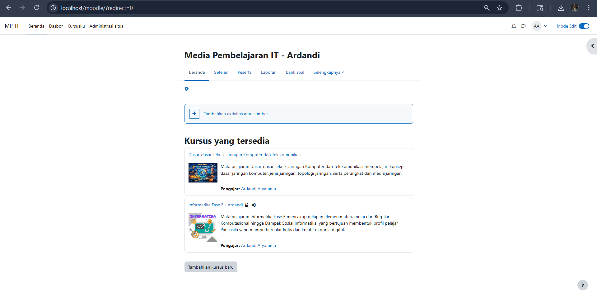

# MP-IT
Moodle Pembelajaran Teknik Jaringan Komputer dan Telekomunikasi

---

## Tampilan Sistem

---

## Deskripsi
Project ini merupakan pengembangan Learning Management System (LMS) berbasis Moodle yang digunakan untuk pembelajaran Teknik Jaringan Komputer dan Telekomunikasi.

Pada project ini ditambahkan plugin **Adminer** untuk mempermudah pengelolaan database secara langsung melalui antarmuka web.

---

## Tentang Plugin Adminer
Moodle Adminer merupakan plugin yang berbasis dari tool Adminer (www.adminer.org).

Keunggulan plugin ini:
- Mendukung berbagai jenis database
- MySQL
- PostgreSQL
- Oracle
- Microsoft SQL Server

---

## Installation
1. Salin folder `adminer` ke:
   moodle/local/adminer

2. Buka:
   http://localhost/moodle/admin

3. Masuk ke:
   Site administration → Notifications

---

## Penggunaan
Site administration → Server → Moodle Adminer

---

## Update Terbaru
Project masih dalam tahap pengembangan.

---

## Author
Ardandi Aryatama
